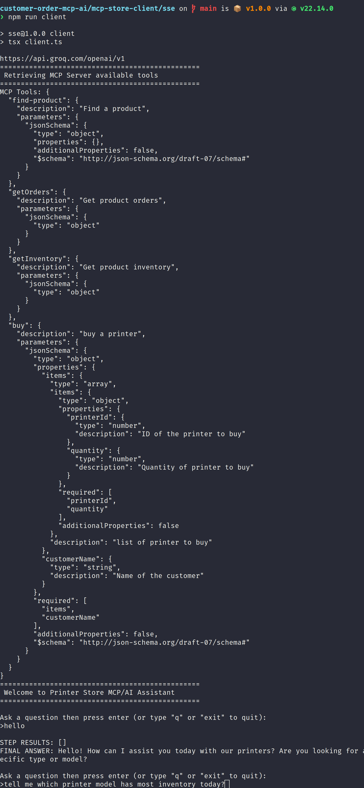

# Storefront MCP Tool Enable AI-Assistant
Experimental Printer Store MCP-SSE Enabled AI Assistant that support customer inquiries about product inventory, facilitates purchase transactions, and handles analytics questions.

## Solution Architecture


## Features
- Provide customer service through AI/Assistant with real-time access to product information and inventory levels, allowing for custom orders.
- Recommend products based on customer preferences and available stock.
- Use the MCP tool server for real-time interaction with microservices.
- Check real-time inventory levels when answering product inquiries.
- Facilitate product purchases by using product IDs and quantities.
- Update inventory levels in real time after order fulfillment.
- Offer ad-hoc analytics on order transactions through natural language queries.

## Use Case Samples
### Using CLI AI/Assistant in support


### Using Web AI/Assistant in Web storefront


## Environment Setup
```
❯ node --version
v22.14.0
❯ npm --version
10.9.2
❯ pnpm --version
10.6.5
```
## Setup LLM Provider 
```
❯ cat .env_example 
GROQ_API_KEY="Your GROQ_API_KEY"
GROQ_API_URL="https://api.groq.com/openai/v1"
> make a copy to file .env 
cp .env.examples .env
> enter your own API key
```
repeat above step in MCP client and server folder

## Setup API Servers 
#### Run Microservices Products API (port 8082)
```
$ git clone https://github.com/minyang-chen/customer-order-mcp-ai.git
$ cd backoffice-products-api
$ npm install
$ npm run dev 
```
result log
```
customer-order-mcp-ai/backoffice-products-api on  main via  v22.14.0 
❯ npm run dev

> products-api@1.0.0 dev
> PORT=8082 tsx watch server.ts

Printer Store Products API Server is running on port http://localhost:8082
/products
```
#### Run Microservices Order Fulfimment API (port 8081)
```
$ git clone https://github.com/minyang-chen/customer-order-mcp-ai.git
$ cd backoffice-fulfillment-api
$ npm install
$ npm run dev 
```
result log
```
❯ npm run dev

> fulfillment-api@1.0.0 dev
> PORT=8081 tsx watch server.ts

Printer Store Fulfillment API Server is running on port http://localhost:8081
/inventory
/orders
/purchase
```
## Setup MCP Servers 

#### Run Order MCP Server (port 8083)
```
$ git clone https://github.com/minyang-chen/customer-order-mcp-ai.git
$ cd mcp-order-server
$ npm install
$ npm run dev 
```
result log
```
❯ npm run start

> apps@1.0.0 start
> node order-sse-server.js

Printer Store MCP SSE Server is running on http://localhost:8083/sse
/sse
/messages
```
## Setup Assistant 

#### Run CLI AI/Assistant
```
$ git clone https://github.com/minyang-chen/customer-order-mcp-ai.git
$ cd mcp-store-client/sse
$ npm install
$ npm run dev 
```
result log
```
customer-order-mcp-ai/mcp-store-client/sse on  main is 📦 v1.0.0 via  v22.14.0 
❯ npm run client

> sse@1.0.0 client
> tsx client.ts

https://api.groq.com/openai/v1
================================================
 Retrieving MCP Server available tools
================================================
MCP Tools: {{
```

## Technology Stack
```
LLM Provider - Groq (Qwen2.5)
AI SDK by Vercel
Nodejs / express for microservices
```
## Contribution
welcome any suggestions and improvement ideas.


